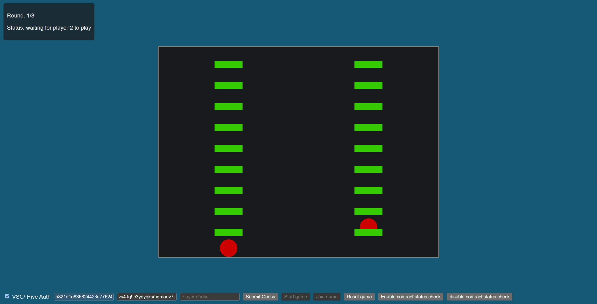

# Examples

This document lists sample projects that build on top of VSC. They can serve as guidance and inspiration for your project.

## Guess a number game

### What is it about

This simple game demonstrates the feasibility of integrating the VSC network into user-facing applications.



The game is very straightforward, 2 players take guesses of numbers and the player that's guess is closer to a _pseudo_ generated random number wins the round. When a player wins a round, they advance the next step on the ladder.

At the end, the player that won the most amount of rounds wins.

### How to play

We first deploy the contract that serves as the backend of the game. Afterwards, we start 2 instances of the frontend that are then going to play against each other.

#### Deploy the contract

Clone the repository of the [contract](https://github.com/Pl8tinium/vsc-app-example-guess-game-contract) and install the npm packages.

```bash
git clone git@github.com:Pl8tinium/vsc-app-example-guess-game-contract.git
npm install
```

Create an _.env_ file to provide your credentials for the contract deployment. Use the _.env.example_ file as a template!

Start an IPFS gateway on your local machine.  

Deploy the contract

```bash
npm run deploy
```

In the output logs, you should be able to find the contract address.

#### Start the UI

Clone the repository of the [frontend](https://github.com/Pl8tinium/vsc-app-example-guess-game-frontend) and install the npm packages.

```bash
git clone git@github.com:Pl8tinium/vsc-app-example-guess-game-frontend.git
npm install
```

Start the frontend.

```bash
npm run dev
```

The logs should hint you the localhost address the server was bound to. Open this address twice to simulate a 2 player environment.  

You can also start the frontend on another machine if you want to simulate a real world scenario or genuinely just want to play the game with someone else.

#### Play the game

Both players need to provide authentification credentials. This can be done by either using a HIVE or light account.

After credentials are provided the contract address needs to be input.  

Now start the contract status check by pressing the button `Enable contract status check`. This process regularly scans the contract storage for changes so that your frontend can react to it.

One of the 2 players can now start the game session by clicking start game. The other player can then join via the button `Join game`.

> Note: The current block times don't provide instant feedback to your actions. Press the buttons once and wait for some time, before you press the buttons again. Do _NOT_ spam the buttons. You can also see the state of your transaction in a VSC block explorer and you can check the developer console of the frontend for possible errors related to the submission.

The game should now be initiated. Both players can, independently of each other, take a random guess. Just insert a number into the text box and confirm with `Submit guess`.

This process repeats until a winner is found. The UI updates accordingly and the game can be reset (replayed) by the `Reset game` button.

### What happens in the background?

The logic of the smart contract is the core of the game. It prevents players from cheating by being responsible for the random number generation and the decision making when it comes to announcing the winner.  

Under the hood, it has multiple entrypoints that mirror the basic functionalities that were described in the _play the game_ section. The frontend is simply just a wrapper to invoke those functions.

Don't hesitate to take a look at the code! It should be fairly simple to understand, because of it's very basic functionality.